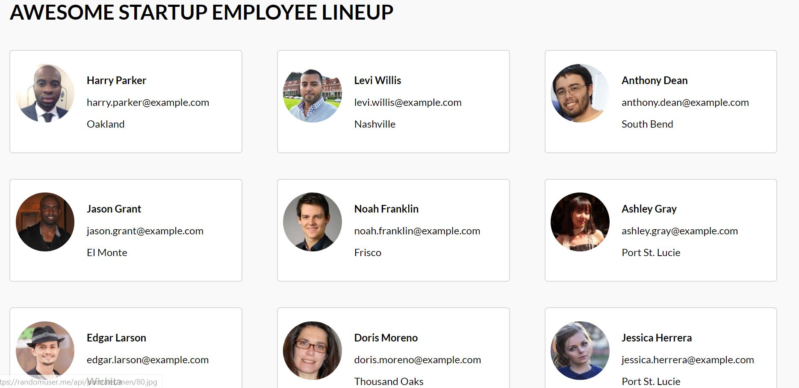
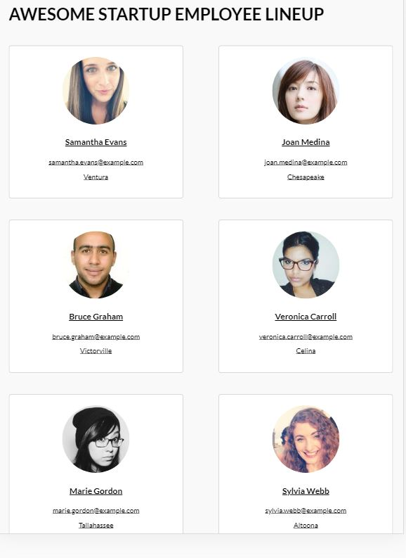

# Employee Gallery Design

## Purpose

To create a responsive employee gallery that incorporates a lightbox effect when clicks or touched on. 
There are three breakpoints to correspond for mobile, tablet, and desktop.  

## Desktop 

## Tablet & Mobile

## Lightbox

The data is fetched from the random user api.  
The gallery will display the employee picture, name, email, and city of resident while the modal will provide much greater detail around the individual.  
To exit, simple click or tap outside the modal  
